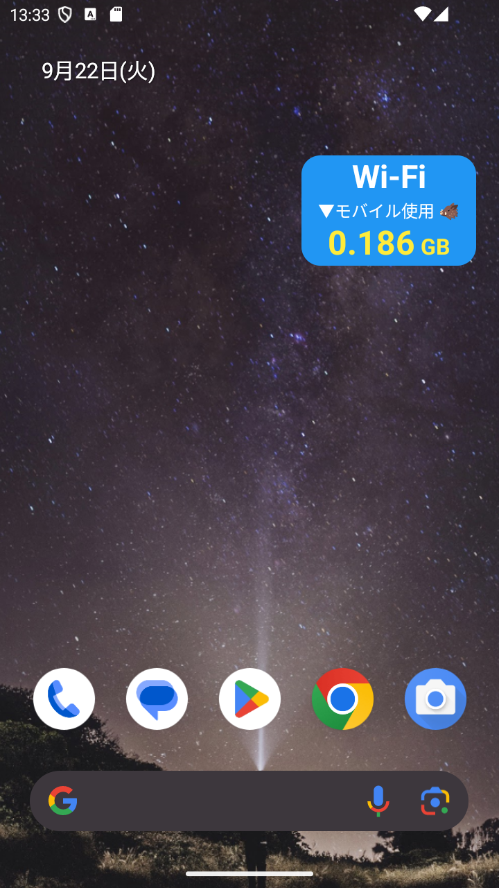
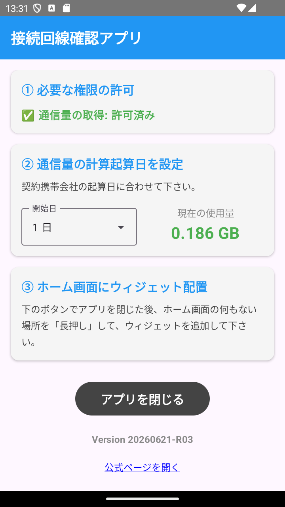

# 接続回線確認アプリ

いまスマホがどの回線につながっているか（Wi-Fi かモバイルか）と、今月のモバイルデータ使用量を、ホーム画面のウィジェットに表示するアプリです。

| ウィジェット | 設定画面 |
| :---: | :---: |
|  |  |

## 主な機能

- 接続中の回線を背景色で表示（Wi-Fi = 青 / モバイル = 赤 / 圏外 = 灰）
- 今月のモバイルデータ使用量を表示
- 使用量を数え始める起算日（請求サイクルの開始日）を設定可能
- ウィジェットを 1x1 〜 2x1 のサイズに変更可能
- ウィジェットの背景の透明度を調整可能（追加設定）

## 権限

| 権限 | 用途 |
| --- | --- |
| `ACCESS_NETWORK_STATE` | 接続中の回線が Wi-Fi かモバイルかを判定するため |
| `PACKAGE_USAGE_STATS`（使用状況へのアクセス） | モバイルデータの使用量を取得するため |

インターネットへの通信は一切行いません。取得した情報は端末内でのみ使用します。

## 動作環境

Android 8.0（API 26）以上

## インストール

[Releases ページ](https://github.com/eightbrows/connect_checker/releases)から最新の APKをダウンロードして、端末にインストールしてください。

Google Play 以外からのインストールになるため、初回は「提供元不明のアプリ」のインストール許可を求められます。

## 使い方

1. アプリを起動し、「使用状況へのアクセス」を許可する
2. 契約している携帯会社に合わせて、起算日を設定する
3. アプリを閉じ、ホーム画面を長押ししてウィジェットを配置する

## ライセンス

[Apache License 2.0](LICENSE)
